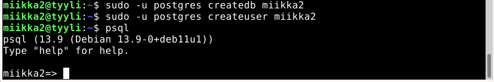
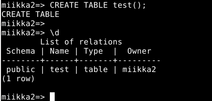
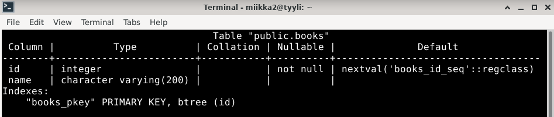
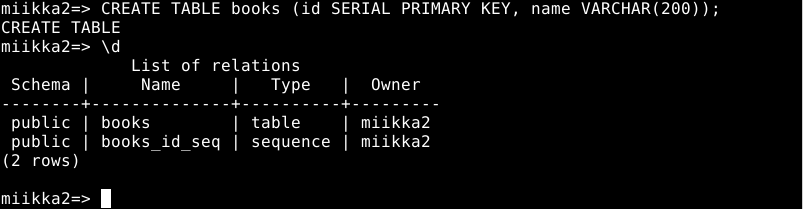
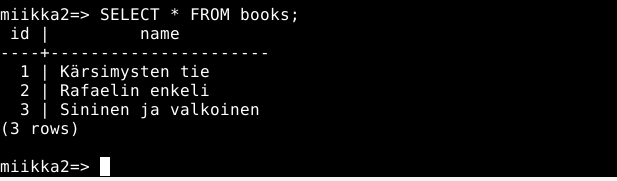
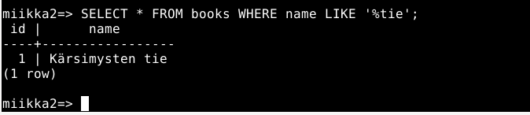
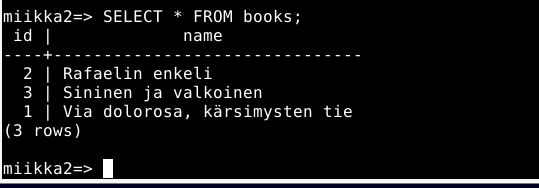
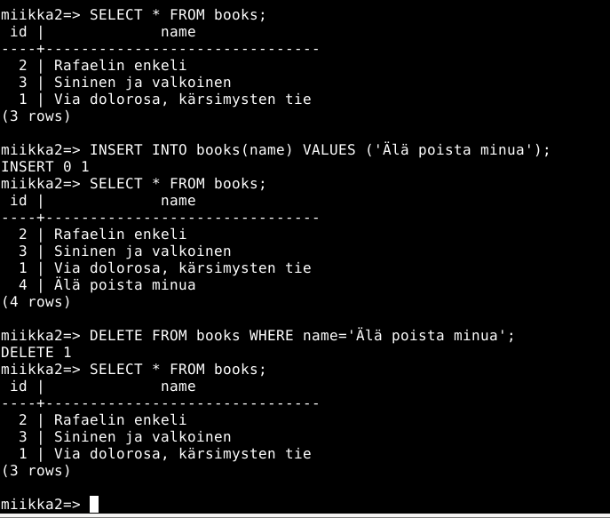

# h9 Sequel

Kone

- MacBook Air(2015) 
- Intel i5 1,6 GHz Dual-Core prossu
- 8 GB RAM
- macOS Monterey v.12.6.2

## x) Esimerkki palvelusta.

- Mieleeni tuli esimerkiksi kuvitteellinen palvelu, joka vuokraa autoja. Yrityksellä, joka vuokraa autoja on luultavasti todella paljon tarjolla erilaisia autoja asiakkaille. Tietokannan avulla autojen yksityiskohtaiset tiedot sekä varusteet yms on helppo tallettaa tietokantaa sekä hakea ne tietokannasta koodin avulla. Tietokantaan on helppo päivittää autojen tietoja sekä varusteita esimerkiksi kovakoodaamisen sijaan. Tietokantaan pystyy myös helposti tallettamaan kaikki tarpeelliset tiedot esimerkiksi vuokrauksista/vuokrasopimuksista sekä vuokraavien asiakkaiden yhteystiedoista. 
- Koodin avulla tietokantaa pystyy päivittämään vaivattomasti vaikka weppisivujen kautta, jolloin vuokrauspalvelun tietojen päivittämisestä sekä ylläpidosta tulee paljon helpompaa. Tiedot pysyvät ajantasalla ja wepissä selaimelle on helpompi luoda palvelulle ominaisuuksia. Esimerkiksi varauspalvelu on helppo luoda tietokannan säilömien tietojen avulla, tietokannan avulla palvelu yhdistää tietyn asiakkaan vuokrattavaan autoon jne. Myös autojen esittelyt on kätevä luoda weppisivulle hakemalla autojen tiedot tietokannasta. 

## a)

- Asensin Postgre:n jo edellisellä tunnilla, joten loin uuden käyttäjän.
- Komento: ``$ sudo adduser miikka2``, seurasin komentokehotteen ohjeita. Syötin salasanan sekä kohtaan Full Name: Test user for Miikka.
- Annoin käyttäjälle sudo oikeudet ``$ sudo adduser miikka2 sudo``
- Kirjauduin uudella käyttäjällä sisään ja käynnistin sillä ``postgresql`` komennolla ``$ sudo systemctl start postgresql``
- Loin uuden tietokannan uudelle käyttäjälleni komennolla ``$ sudo -u postgres createdb miikka2``
- Loin uuden tietokantakäyttäjän komennolla ``$ sudo -u postgres createuser miikka2``

- Komennolla ``$ psql`` avasin postgresql:n.
- Testasin, että SQL-komennot toimii luomalla tyhjän taulun tietokantaan. Loin taulun lausekkeella: ``CREATE TABLE testi();`` ja katsoin onnistuiko taulukon luominen syöttämällä ``\d``

- Taulukon luominen onnistui eli SQL-komennot toimii.

- Komennolla ``\d books;`` näkee taulukon rakenteen, tässä näkyy esimerkiksi luomani ``PRIMARY KEY id``, sekä ``name`` sarake sekä niiden tyypit ``integer``/numero, ``character varying(200)``/max 200 merkkinen merkkijono, sekä esim id:n määritelmät/ehdot. ``not null``= ei voi olla null arvo ja Defaultissa määritellään, että tietokanta luo automaattisesti uuden id:n esimerkiksi, kun luodaan taulukkoon uusi kirja. ``Indexes`` kertoo talukon ``PRIMARY KEY``:n, joka on ``id``

## b)

- Poistin a) kohdassa testiksi luomani taulukon tietokannasta lausekkeella ``DROP TABLE test;``. ``DROP TABLE`` lausekkeen alla kertoo, että komento toteutui. Tarkistin vielä ``\d``, vastaukseksi tuli "Did not found any relations" eli taulukko poistui.

### CREATE

- Loin uuden taulukon kirjoille lausekkeella ``CREATE TABLE books (id SERIAL PRIMARY KEY, name VARCHAR(200));
  - SERIAL id luo automaattisesti numeraalisen id:n.
  - name VARCHAR(200), luo "name" sarakkeen, joka on max 200 merkkinen merkkijono.
- Katsoin luomani taulukon komennolla``\d``, taulukon luominen onnistui.

- Seuraavaksi syötin hieman tietoja juuri luomaani "books" taulukkoon. 
- Syötän taulukkoon muutaman päästä keksimäni nimen komennolla ``INSERT INTO books(name) VALUES('nimi')``;

### READ

- Katsotaan tulivatko nimet näkyviin taulukkoon komennolla ``SELECT * FROM books;``

- Kyllä vain, nimien lisääminen onnistui.

- SELECT lausekkeisiin voi sisällyttää ehtoja, jotka helpottavat merkittävästi isoista tietokannoista haluttujen asioiden hakemista. Tässä massiivisessa tietokannassa hain kirjojen nimistä "tie" sanaan loppuvaa kirjan nimeä komennolla ``SELECT * FROM books WHERE name LIKE '%tie'``. Lausekkeessa ``%`` ennen "tie" sanaa määrittelee, että "tie" sanaa ennen voi olla mitä vain merkkejä.

#### Tulos:

### UPDATE

- Päivitin "Kärsimysten tie" kirjan nimen lausekkeella ``UPDATE books SET name='Via dolorosa, kärsimysten tie' WHERE name='Kärsimysten tie';``
- Katsotaan jälleen päivittyiki nimi taulukkoon: ``SELECT * FROM books;``

- Kyllä päivittyi.

### DELETE

- Kirjan poistaminen luonnistuu lausekkeella: ``DELETE FROM table WHERE name='nimi'``. 
- Ensin listasin kirjat ``SELECT * FROM books;``
- Poistin kirjan: ``DELETE FROM books WHERE name='Älä poista minua'``, ``DELETE 1`` kertoo, että lauseke suoritettiin.
- Varmistin, että kirja poistui listaamalla kirjat uudelleen.

- Kirjaa ei löydy enää taulukosta eli poistaminen onnistui.
